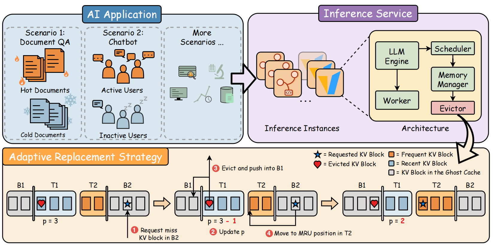

# Recency/Frequency Adaptive KV Caching for Large Language Model Serving

<p align="center">
  
</p>

Implementation [Checklist](vllm/core/README.md).

## Installation
#### 1. Clone the Repository
```
git clone https://github.com/Y-aang/vllm-ARC.git
cd vllm-ARC
```
#### 2. Install Depencencies
Refer to the [vLLM Installation Guide](https://docs.vllm.ai/en/latest/getting_started/installation/) for hardware-specific dependencies.
#### 3. Build & Install vLLM-ARC
Install vLLM-ARC in editable mode from this repo. Reference to [Build wheel from source using Python-only build (without compilation)](https://docs.vllm.ai/en/latest/getting_started/installation/gpu/#python-only-build).
```
VLLM_USE_PRECOMPILED=1 pip install --editable .
```
#### 4. Enable Adaptive KV Caching
```
export VLLM_CUSTOMIZED_EVICTOR_TYPE=ARC    # LRU, DBL
```
## Experiment Script
All experiment scripts are available in the repository: [vllm-arc-test-scripts](https://github.com/Y-aang/vllm-arc-test-scripts).


